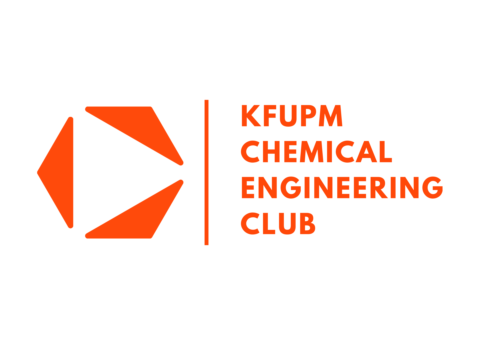

<div align="center">
  
  
  # 🧪 Chemistry Club Website
  
  ### A modern, responsive web platform for the Chemistry Club community
  
  [](https://nextjs.org/)
  [](https://reactjs.org/)
  [](https://www.typescriptlang.org/)
  [](https://tailwindcss.com/)

[🌐 Live Demo](https://chemclubwebsite.netlify.app)

</div>

---

## ✨ Overview

The Chemistry Club Website is a modern, fully responsive web application designed to connect students, share resources, showcase events, and promote the chemistry community. Built with cutting-edge technologies, it provides an engaging user experience across all devices.

## 🌟 Features

### 🏠 **Home Page**

- **Dynamic Hero Section** - Eye-catching introduction with smooth animations
- **What We Offer** - Showcase club benefits and opportunities
- **Upcoming Events** - Interactive event cards with detailed information
- **Responsive Design** - Seamlessly adapts from mobile to desktop

### 👥 **About Us**

- **Club Introduction** - Learn about our mission and vision
- **Core Values** - Discover what drives our community
- **Mission Statement** - Understand our goals and objectives
- **Organization Chart** - Visual representation of club structure
- **Member Profiles** - Meet the leadership team with LinkedIn integration

### 📅 **Calendar**

- **Event Scheduling** - Stay updated with upcoming events and activities
- **Interactive Interface** - Easy-to-use calendar view

### 📚 **Resources**

- **Academic Materials** - Access chemistry resources and study materials
- **Course Flowcharts** - Navigate chemistry curriculum pathways
- **Downloadable Content** - Important files and documents for members

## 🛠️ Tech Stack

### **Frontend Framework**

- **Next.js** (latest) - React framework with App Router
- **React 19.0.0** - UI component library
- **TypeScript 5.7.2** - Type-safe development

### **Styling & Animation**

- **Tailwind CSS 3.4.16** - Utility-first CSS framework
- **Framer Motion 11.18.2** - Advanced animations and transitions
- **GSAP 3.13.0** - Professional-grade animations
- **React Bootstrap 2.10.10** - Component library

### **UI Components**

- **NextUI / HeroUI** - Modern UI components
- **Lucide React** - Beautiful icon library
- **React Icons** - Extensive icon collection
- **React Social Icons** - Social media integration

### **Additional Libraries**

- **Day.js** - Date manipulation
- **React Multi Carousel** - Responsive carousel component
- **Autoprefixer** - CSS vendor prefixing

## 🚀 Getting Started

### Prerequisites

Before you begin, ensure you have the following installed:

- **Node.js** (v18 or higher)
- **pnpm** (recommended) or npm

### Installation

1. **Clone the repository**

   ```bash
   git clone https://github.com/yourusername/Chemistry-Club-Website.git
   cd Chemistry-Club-Website
   ```

2. **Navigate to the client directory**

   ```bash
   cd client
   ```

3. **Install dependencies**

   ```bash
   pnpm install
   # or
   npm install
   ```

4. **Run the development server**

   ```bash
   pnpm dev
   # or
   npm run dev
   ```

5. **Open your browser**

   Navigate to [http://localhost:3000](http://localhost:3000) to see the website in action!

## 📦 Available Scripts

| Command      | Description                             |
| ------------ | --------------------------------------- |
| `pnpm dev`   | Start development server with Turbopack |
| `pnpm build` | Create production build                 |
| `pnpm start` | Start production server                 |

## 📂 Project Structure

```
Chemistry-Club-Website/
├── client/
│   ├── app/
│   │   ├── (nav-home)/              # Home page route group
│   │   │   ├── first-part/          # Hero/main navigation
│   │   │   ├── second-part/         # What we offer section
│   │   │   └── third-part/          # Events section
│   │   ├── (nav-others)/            # Other pages route group
│   │   │   ├── about_us/            # About page with 4 parts
│   │   │   ├── calendar/            # Events calendar
│   │   │   └── resources/           # Resources page
│   │   ├── components/
│   │   │   ├── desktop/             # Desktop-specific components
│   │   │   └── mobile/              # Mobile-specific components
│   │   ├── lib/                     # Reusable utilities
│   │   └── ui/                      # Styles and CSS modules
│   ├── public/                      # Static assets
│   ├── package.json
│   └── tailwind.config.ts
└── README.md
```

## 🎨 Design Philosophy

### **Responsive First**

The website provides optimal viewing experience across all devices:

- 📱 **Mobile**: < 765px
- 💻 **Desktop**: ≥ 765px

Separate components ensure perfect rendering on each platform.

### **Modern UI/UX**

- Smooth animations and transitions
- Intuitive navigation
- Clean and professional design
- Accessible and user-friendly interface

## 🤝 Contributing

We welcome contributions from the community! Here's how you can help:

1. **Fork the repository**
2. **Create a feature branch** (`git checkout -b feature/AmazingFeature`)
3. **Commit your changes** (`git commit -m 'Add some AmazingFeature'`)
4. **Push to the branch** (`git push origin feature/AmazingFeature`)
5. **Open a Pull Request**

### Contribution Guidelines

- Follow the existing code style
- Write clear commit messages
- Update documentation as needed
- Test your changes thoroughly

## 📝 Development Notes

### Adding New Members

Update the member data in:

```
client/app/(nav-others)/about_us/fourth-part/membersData.tsx
```

### Updating Events

Events are managed in:

```
client/app/(nav-home)/third-part/events.tsx
```

### Styling

- Global styles: `client/app/ui/global.css`
- Component-specific styles are in respective CSS files under `client/app/ui/`

## 🐛 Known Issues

- Member photos need to be optimized for web (consider Next.js Image component)
- Some member positions are placeholders (marked with "---")

## 🔮 Future Enhancements

- [ ] Member login system
- [ ] Event registration functionality
- [ ] Blog/news section
- [ ] Admin dashboard for content management
- [ ] Email notifications for events
- [ ] Dark mode support
- [ ] Multi-language support

## 📄 License

This project is maintained by the Chemistry Club. All rights reserved.

## 📧 Contact

Chemistry Club Leadership Team

- **Website**: [chemclubwebsite.netlify.app](https://chemclubwebsite.netlify.app)
- **LinkedIn**: Check individual member profiles in the About Us section

---

<div align="center">
  
  **Made with ❤️ and ⚗️ by the Chemistry Club Development Team**
  
  *Empowering students through science and community*

</div>
